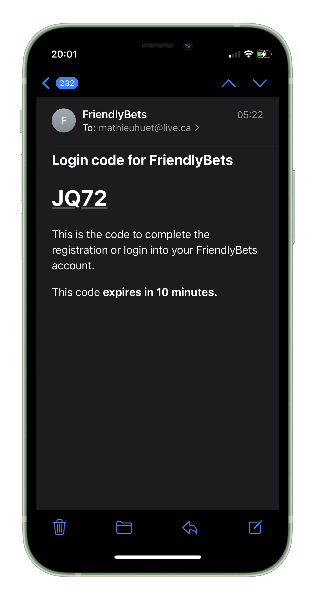

# Server for FriendlyBets  **WORK IN PROGRESS*

Server handling all the back-end work, sending emails, verifying users, fetching data and modifying/adding data.

## Getting Started

To install the required dependencies, you're gonna run `npm install` at the root of this repository

Start the server with `npx nodemon index.js`

You need to create a `secret.js` file at the root of the project that export these variables : `MONGODB_USER_URI` `MONGODB_BET_URI` `MONGODB_USERBET_URI` `MONGODB_BETDETAILS_URI` `PORT` `AUTH_EMAIL` `AUTH_EMAIL_PASSWORD` `SECRET_KEY`

## Tech Stack

The front-end framework is **React Native** and wouldn't been possible without **Expo**

The back-end server is **Express.JS**

The database is **Mongo DB**

## Screenshot

Exemple of an email sent by the server, this email show the verfication code after a user registered and want to login.

